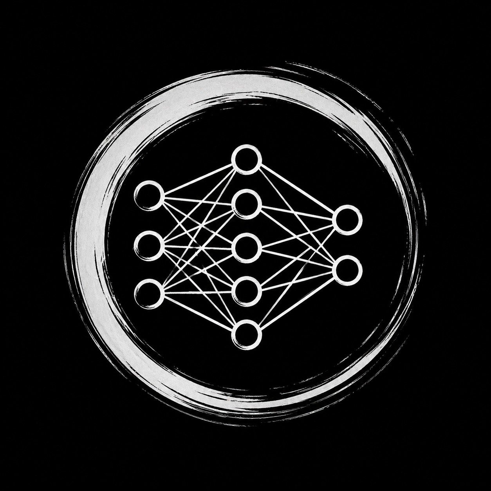

# Tinker til I die

# My Neural Net Project

  

## Matrix multiplication approaches

This project benchmarks the same matrix multiplication workload through three
different execution paths. The generated Python lists are shared input data; each
approach converts or consumes those lists in its own way.

### CUDA/PyTorch approach

Implementation: `basic_matmul/cuda_approach.py`

`cuda_multiply()` converts the nested Python lists into PyTorch tensors, moves
them to the selected CUDA device with `.to("cuda")`, synchronizes the GPU before
and after the measured section, and then runs `a @ b`. For two-dimensional
tensors, `@` dispatches to PyTorch matrix multiplication. On CUDA tensors, that
operation is scheduled on the GPU rather than executed by the Python interpreter.

Resource usage: Python still runs on the CPU to create tensors, issue PyTorch
calls, and print results, but the measured matrix multiplication runs on the
NVIDIA GPU through CUDA. GPU device memory stores the tensors after `.to("cuda")`;
CUDA cores and tensor cores may be used depending on the GPU, PyTorch build,
input dtype, and matmul precision settings.

Precise references:

- [PyTorch CUDA semantics](https://docs.pytorch.org/docs/2.9/notes/cuda.html):
  device selection, CUDA tensor placement, cross-device behavior,
  synchronization concerns, and CUDA matmul precision behavior such as TF32.
- [PyTorch `torch.matmul`](https://docs.pytorch.org/docs/stable/generated/torch.matmul.html):
  exact `matmul` shape rules, broadcasting behavior, sparse-layout notes, and
  TensorFloat32 support.
- [NVIDIA CUDA Programming Guide](https://docs.nvidia.com/cuda/cuda-programming-guide/index.html):
  the underlying CUDA execution model, SIMT kernels, device memory, and GPU
  programming concepts that PyTorch uses below its Python API.
- [NVIDIA cuBLAS documentation](https://docs.nvidia.com/cuda/cublas/):
  the CUDA BLAS library family, including GEMM-focused APIs such as cuBLASLt,
  which explain the kind of GPU matrix-multiply kernels used by CUDA math
  stacks.

### NumPy approach

Implementation: `basic_matmul/numpy_approach.py`

`numpy_multiply()` converts the nested Python lists into NumPy arrays and calls
`numpy.matmul(a, b)`. For two-dimensional arrays, NumPy treats the inputs as
conventional matrices and returns their matrix product. The heavy numerical
work happens in compiled native code, not in a Python loop.

Resource usage: this approach uses the CPU and system RAM. Python coordinates
array creation and the function call, while NumPy performs the matrix
multiplication in compiled CPU code. Depending on how NumPy was built, that CPU
work may use optimized BLAS libraries, multiple CPU threads, vector/SIMD
instructions, and CPU cache-aware kernels. It does not use the GPU.

Precise references:

- [NumPy `matmul`](https://numpy.org/doc/2.1/reference/generated/numpy.matmul.html):
  the public operation contract, including two-dimensional matrix product
  behavior, higher-dimensional stack behavior, output shape, and error cases.
- [NumPy linear algebra](https://numpy.org/doc/2.3/reference/routines.linalg.html):
  how NumPy linear algebra relies on BLAS and LAPACK for efficient low-level
  implementations when optimized libraries are available.
- [NumPy BLAS and LAPACK build selection](https://numpy.org/doc/2.4/building/blas_lapack.html):
  how NumPy selects libraries such as MKL, Accelerate, OpenBLAS, FlexiBLAS,
  BLIS, or fallback routines at build time.
- [NumPy CPU/SIMD optimizations](https://numpy.org/doc/2.4/reference/simd/index.html):
  how NumPy dispatches compiled kernels based on CPU features detected at
  runtime.

### Raw Python approach

Implementation: `basic_matmul/raw_python_approach.py`

`raw_python_multiply()` keeps the data as Python lists. It first transposes the
right-hand matrix into columns, then computes every output cell as the dot
product of one row and one column using `zip(..., strict=True)`, multiplication,
and `sum()`. This path is intentionally direct: every scalar multiply/add is
driven through Python-level iteration.

Resource usage: this approach uses the CPU and system RAM through ordinary
Python objects. The work is dominated by Python interpreter overhead, list
accesses, generator iteration, floating-point object handling, and repeated
calls into Python's runtime machinery. It does not use the GPU, BLAS, or
vectorized native kernels for the core multiplication loop.

Precise references:

- [Python built-in functions](https://docs.python.org/3/library/functions.html):
  details for `sum()`, `zip()`, `len()`, and `range()`, including the
  `strict=True` behavior used to validate matching row/column lengths.
- [Python data structures and list comprehensions](https://docs.python.org/3/tutorial/datastructures.html):
  how lists and nested list comprehensions are evaluated, including matrix-style
  transformations and transposition examples.
